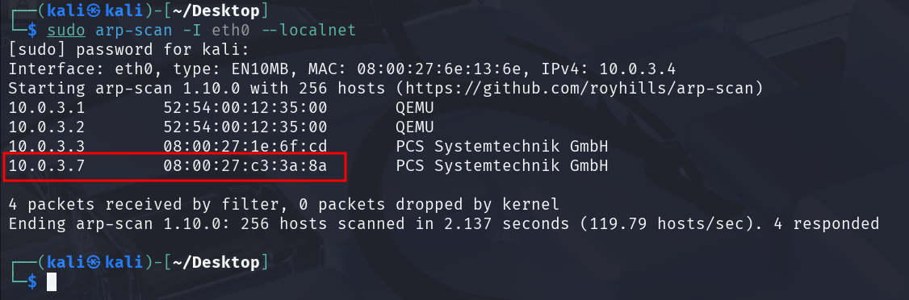

# Qué es el Fuzzing Web – Uso de Gobuster

Maquinas a utilizar **Kali Linux y Metasploitable2**

Vamos a ver como hacer **Fuzzing Web** que consiste básicamente en encontrar directorios dentro de una pagina web.

Cuándo entramos en una pagina web no sabemos a priori si tiene un directorio /admin, /login, etc… Para poder encontrar esas ubicaciones se emplea una técnica llamada Fuzzing.

```bash
sudo arp-scan -I eth0 --localnet
```



```bash
ping -c 1 10.0.3.7
```


```bash
nmap -p- -sS -sV -sC -min-rate 5000 -n -vvv -Pn 10.0.3.7
```


Vemos que tiene **abierto el puerto 80**

- Vamos a usar la herramienta gobuster que en mi caso no esta instala y la voy a instalar.
    
    ```bash
    sudo apt install gobuster 
    ```
    

Y ejecutamos el gobuster.

```bash
gobuster dir -u http://10.0.3.7/ -w /usr/share/wordlists/dirbuster/directory-list-lowercase-2.3-medium.txt
```

### Parámetros:

1. **`gobuster`**: Es una herramienta de fuerza bruta utilizada para descubrir directorios o archivos en aplicaciones web. Funciona enviando solicitudes HTTP basadas en un diccionario.
2. **`dir`**: Modo de operación de `gobuster`. La opción `dir` indica que se desea buscar directorios (y, potencialmente, archivos) en la URL especificada.
3. **`u http://10.0.3.7/`**: La opción `u` especifica la URL objetivo. En este caso, la dirección es `http://10.0.3.7/`. Esto significa que se está apuntando a un servidor ubicado en esa dirección IP.
4. **`w /usr/share/wordlists/dirbuster/directory-list-lowercase-2.3-medium.txt`**:
    - La opción `w` especifica el diccionario o lista de palabras que se usará para probar posibles nombres de directorios o archivos.
    - En este caso, el archivo proporcionado es `directory-list-lowercase-2.3-medium.txt`, que es un archivo de texto comúnmente utilizado con herramientas como `dirbuster` o `gobuster`. Contiene una lista predefinida de posibles directorios o archivos para probar.

Este comando intenta encontrar directorios o archivos ocultos en el servidor alojado en `http://10.0.3.7/`. Utilizando el archivo de lista de palabras proporcionado, `gobuster` enviará una solicitud HTTP por cada elemento del diccionario, verificando si ese directorio o archivo existe.


Nos a encontrado varios directorios , vamos a ver alguno por ejemplo /phpinfo


- También es posible que nos busque archivos por nombre del archivo o extensiones.
    
    ```bash
    gobuster dir -u [http://10.0.3.7/](./imagenes/http://10.0.3.7/) -w /usr/share/wordlists/dirbuster/directory-list-lowercase-2.3-medium.txt **-x txt,py,php,sh**
    ```
    

`-x txt,py,php,sh`: -x permite especificar extensiones de archivo a buscar. En este caso, se incluyen archivos con extensiones .txt, .py, .php y .sh. Esto significa que gobuster buscará archivos con esos formatos en cada directorio.


En caso de que **no este instalada** la herramienta **gobuster** y no tengamos la opción de instalarla , tenemos la **alternativa de usar** la herramienta **dirb. NOTA:** Siempre es conveniente usar las dos herramientas.

```bash
dirb [http://10.0.3.7/](./imagenes/http://10.0.3.7/)
```

