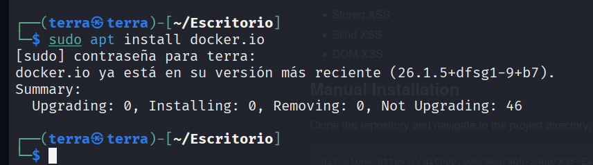

# Uso Básico de contendores Docker

Para la descargar un contenedor Docker es preferible seguir las indicaciones del Creador del contenedor.

Pero a partir de aquí es interesante conocer algunos comandos para la administración de contenedores Docker.

- **Instalación de  Docker**. En una terminal escribimos lo siguiente.
    
    ```bash
    sudo apt install [docker.io](./imagenes/http://docker.io/) 
    ```
    
    
    
    En mi caso ya lo tenia instalado , si no se instalaría.
    
- **Despliegue de un contenedor Docker**.
    
    Por defecto el comando seria este 
    
    ```bash
    docker run nombre_de_la_imagen_Docker
    ```
    

El creador de la imagen Docker también nos puede facilitar un comando con los parámetros para el despliegue  como por ejemplo el siguiente.

```bash
sudo docker run -d -p 80:80 sourabhs4hu/xss-easy-start:v1
```


- **Listado Contenedores activos**.
    
    ```bash
    sudo docker ps
    ```
    
    
    

- Si queremos ver todos los **contendores activo y inactivos**.
    
    ```bash
    docker ps -a
    ```
    

### Detener el contendor  y eliminar la imagen Docker

- En un terminal listamos los contenedores de Docker en funcionamiento
    
    ```bash
    sudo docker ps
    ```
    
    
    

- Detenemos el contenedor Docker poniendo los dos primeros caracteres de ID del contendor que queremos parar.
    
    ```bash
    sudo docker stop df
    ```
    
    
    

- Listamos las imágenes Docker instaladas en el sistema
    
    ```bash
    sudo docker images
    ```
    
    
    

- Eliminamos la Imagen que queramos
    
    