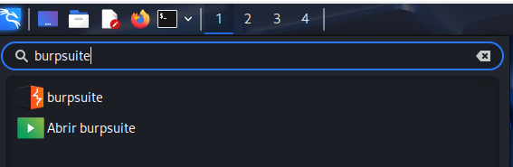

# Configuración y uso Básico de BurpSuite

Es una herramienta que se pone entre nuestro navegador web y el Servidor . Es capaz de interceptar peticiones http y así poder explotar vulnerabilidades.

- Vamos a aplicar antes de nada unos pequeños ajuste dentro del navegador web Firefox (. Para que BurpSuite pueda interceptar el trafico tanto http como https.
    
    
    <aside>
    💡¡¡OJO!! Esta configuración impedirá que naveguemos normalmente por internet en el navegador donde la utilicemos. Para volver a navegar normalmente debemos volver a poner la configuración de “ Connection Settings” en “Use system proxy settings”
    
    </aside>
    
    ### Configuración Manual
    
    **Ajustes → Settings**
    
    
    

**General→ Network Settings**

**Manual proxy configuration**

**HTTP Proxy: 127.0.0.1  Port: 8080**

Activamos la opción : **Also use this proxy for HTTPS**

Debemos recordar que si usamos este método siempre debemos activar y desactivar el proxy desde esta ventana cada vez que usemos Burpsuite.

---

### Instalación del Certificado para HTTPS

- En el navegador web escribimos la siguiente URL: [http://burpsuite](./imagenes/http://burpsuite/)
    
    
    

- Pulsamos en “CA Certificate” y nos descargara un certificado que vamos a impórtalo dentro de nuestro navegador. Nos vamos a Settings.
    
    
    

- Privacy & Security → Certificates → View Certificates
    
    
    

- Authorities → Import
    
    
    
- Escogemos el certificado que me acabo de descargar
    
    
    
- Le decimos que confié en el certificado.
    
    
    

- Aceptamos para que se guarden los cambios y ya tendremos configurado la parte del navegador para que funcione BurpSuite.

---

### Configuración mediante ProxyFoxy

Aprovechamos los pasos anteriores y vamos a instalar el plugin Proxyfoxy para habilitar y deshabilitar la configuración del proxy rápidamente.

- Pulsamos las tres líneas de la parte superior derecha y escogemos “Add-ons and themes”
    
    
    

- Buscamos Proxyfoxy
    
    
    

- Lo escogemos para instalarlo
    
    
    

- Configuramos el plugin para Burpsuite
    
    
    

- Rellenamos los campos tal y como aparecen en la imagen
    
    
    

- Si pulsamos sobre el icono que nos aparecerá en la parte superior del navegador podremos activar o desactivar el Proxy.
    
    
    

---

### Uso básico de BurpSuite

- Vamos a probarlo. Abrimos BurpSuite . Nos vamos a la Pestaña Proxy y activamos la intercepción.

- En el navegador web abrimos por ejemplo http:\\[google.es](./imagenes/http://google.es/)
    
    El navegador se quedara como esperando sin cargar la pagina. Pero Nuestro BurpSuite nos mostrara información parecida a esta que es la que a interceptado.
    
    
    

- Ahora aquí podríamos cambiar lo que quisiéramos y seria lo que enviaríamos al servidor.
- Una opción interesante para probar sin tener que estar repitiendo la llamada al servidor cada vez que queremos probar un cambio. Seria usar la pestaña Repeter.
    - Para ello seleccionamos todo y desplegamos el menú contextual con la tecla derecha del ratón. Donde escogeremos la opción “Send to Repeater”.
        
        
        
        
        
    
    <aside>
    💡
    
    Podríamos haberlo hecho también pulsando CTRL+R
    
    </aside>
    
    Ahora podría ir cambiado lo que quisiera y ver la respuesta del servidor sin perder la petición.
    
    