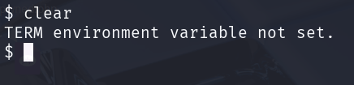

# Primeros pasos tras la Intrusión (Tratamiento de la TTY)

El "Tratamiento de la TTY" se refiere a un conjunto de ajustes y configuraciones que se aplican a una terminal en sistemas Unix/Linux para mejorar su funcionalidad, especialmente en situaciones como el uso de una reverse shell. Esto puede incluir ajustar proporciones de filas y columnas, habilitar atajos de teclado, y garantizar que la terminal sea completamente funcional y no limitada.

Cuando ganamos acceso remoto a la maquina victima nos solemos encontrar que la terminal no es muy funcional por ejemplo hay comandos que no puedo ejecutar como por ejemplo el comando clear lo que hacer que sea complicado manejar el terminal .

- Vamos a empezar el tratamiento de la TTY . Nos colocamos en la terminal de la maquina victima.
- Escribimos el siguiente comando  y veremos que adquirimos un prompt.
    
    `script /dev/null -c bash`
    
    
    
- Hacemos un **`CTRL+Z`**
    
    
    

- Escribimos a continuación.
    
    `stty raw -echo; fg`
    
    
    

- Escribimos `reset xterm` . Es posible que no se muestre cuando lo escribimos pero aun así lo escribimos y pulsamos Enter. Y nos aparecerá la siguiente pantalla.
    
    
    

- Por ultimo tenemos que exportar 2 variables. escribimos lo siguiente.
    
    `export TERM=xterm`
    
    `export SHELL=bash`
    
    
    
    Con esto ya abrimos estabilizado el terminal y ya nos aceptaría los comandos que antes no lo hacia.