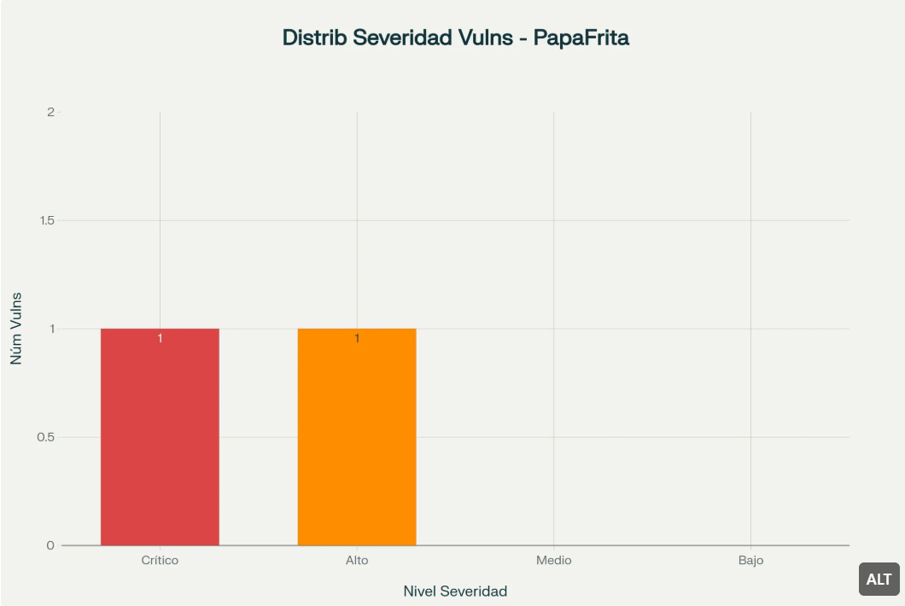

# PapaFrita - Informe de Pruebas de Penetración

# Informe de Pruebas de Penetración: Máquina PapaFrita

El presente informe documenta los hallazgos y resultados obtenidos durante la auditoría de seguridad realizada sobre la máquina virtual “PapaFrita” del laboratorio de prácticas de The Hacker’s Labs. Esta evaluación reveló vulnerabilidades críticas que permitieron el compromiso total del sistema, incluyendo la obtención de privilegios de administrador. Las principales debilidades identificadas incluyen la exposición de información sensible en el código fuente de la aplicación web y una configuración inadecuada de permisos sudo que facilita la escalación de privilegios.

## Resumen Ejecutivo

### Alcance y Objetivos

La evaluación se realizó sobre la máquina virtual “PapaFrita” (IP: 10.0.3.30) disponible en el laboratorio https://thehackerslabs.com/papafrita/. El objetivo principal fue identificar vulnerabilidades de seguridad y demostrar técnicas de explotación en un entorno controlado de aprendizaje. El pentesting siguió una metodología estructurada basada en los estándares PTES (Penetration Testing Execution Standard) y las mejores prácticas documentadas por OWASP.

### Hallazgos Principales

Durante la auditoría se identificaron **2 vulnerabilidades de seguridad**, clasificadas de la siguiente manera:

- **1 vulnerabilidad crítica** (CVSS 9.8): Escalación de privilegios mediante configuración insegura de sudo
- **1 vulnerabilidad de alto riesgo** (CVSS 7.5): Exposición de información sensible en código fuente



Distribución por severidad de las 2 vulnerabilidades identificadas en el pentesting de PapaFrita, mostrando 1 vulnerabilidad crítica y 1 de alto riesgo

### Impacto en el Negocio

Las vulnerabilidades identificadas representan un riesgo significativo para la seguridad del sistema. La combinación de estas fallas permite a un atacante remoto obtener acceso completo al sistema, comprometer la confidencialidad, integridad y disponibilidad de los datos, y establecer persistencia en el entorno. En un contexto empresarial real, esto podría resultar en pérdida de datos sensibles, interrupción del servicio y daño reputacional.[5](./imagenesInfo/about:blank#fn5)

## Metodología y Alcance

### Enfoque Metodológico

El pentesting se ejecutó siguiendo las fases establecidas en el marco PTES, que incluye preengagement, reconocimiento, análisis de vulnerabilidades, explotación, post-explotación y documentación. Esta metodología garantiza un enfoque sistemático y reproducible para la identificación y explotación de vulnerabilidades.[6](./imagenesInfo/about:blank#fn6)[7](./imagenesInfo/about:blank#fn7)


Flujo del proceso de pentesting ejecutado en la máquina PapaFrita, desde reconocimiento hasta post-explotación

### Herramientas Utilizadas

La evaluación empleó diversas herramientas especializadas en cada fase del proceso:

| Fase | Herramienta | Propósito |
| --- | --- | --- |
| Reconocimiento | arp-scan | Descubrimiento de hosts en red local |
| Reconocimiento | nmap | Escaneo de puertos y servicios |
| Análisis Web | Navegador Web | Inspección de código fuente HTML |
| Análisis Web | dcode.fr | Decodificación de código Brainfuck |
| Acceso Inicial | SSH | Conexión remota SSH |
| Escalación Privilegios | GTFOBins | Consulta de técnicas de escalación |
| Post-Explotación | Comandos del Sistema | Navegación y obtención de flags |

### Limitaciones del Alcance

Esta evaluación se realizó en un entorno de laboratorio controlado con fines educativos. Los hallazgos y técnicas documentadas se aplicaron exclusivamente al sistema objetivo autorizado, sin impacto en sistemas de producción o infraestructura crítica.

## Hallazgos Detallados de Vulnerabilidades

### Vulnerabilidad 1: Exposición de Información Sensible en Código Fuente

**Clasificación**: CWE-540 - Inclusion of Sensitive Information in Source Code **CVSS v3.1 Base Score**: 7.5 (Alto)
**Vector CVSS**: AV:N/AC:L/PR:N/UI:N/S:U/C:H/I:N/A:N

**Descripción de la Vulnerabilidad**

Se identificó la presencia de información sensible codificada en el código fuente HTML de la aplicación web que ejecuta en el puerto 80. Específicamente, se encontró una contraseña codificada utilizando el lenguaje esotérico Brainfuck, que al ser decodificada reveló las credenciales “abuelacalientalasopa”.

**Evidencia Técnica**

Durante la inspección del código fuente de la página web (mediante CTRL+U o herramientas de desarrollador), se identificaron líneas de código que contenían secuencias características del lenguaje Brainfuck. Utilizando la herramienta de decodificación disponible en https://www.dcode.fr/, se logró traducir el código ofuscado y obtener la información sensible.

**Impacto**

Esta vulnerabilidad permite a cualquier atacante con acceso a la aplicación web obtener credenciales válidas sin necesidad de técnicas de fuerza bruta o ingeniería social avanzada. El impacto incluye:

- Compromiso inmediato de credenciales de usuario
- Acceso no autorizado a servicios SSH
- Potencial escalación hacia el compromiso total del sistema

**Recomendaciones de Remediación**

1. **Remoción inmediata** de toda información sensible del código fuente accesible al cliente
2. **Implementación de gestión segura de credenciales** utilizando variables de entorno o sistemas de gestión de secretos
3. **Revisión completa del código fuente** para identificar otros datos sensibles expuestos
4. **Establecimiento de políticas de desarrollo seguro** que prohíban el almacenamiento de credenciales en código fuente
5. **Implementación de herramientas de análisis estático** para detectar automáticamente secretos en el código

### Vulnerabilidad 2: Escalación de Privilegios mediante Sudo

**Clasificación**: CWE-78 - OS Command Injection
**CVSS v3.1 Base Score**: 9.8 (Crítico)
**Vector CVSS**: AV:L/AC:L/PR:L/UI:N/S:C/C:H/I:H/A:H

**Descripción de la Vulnerabilidad**

El usuario “abuela” posee permisos sudo para ejecutar `/usr/bin/node` sin requerir contraseña. Esta configuración permite la escalación de privilegios mediante la capacidad de Node.js de ejecutar comandos del sistema operativo a través del módulo `child_process`.

**Evidencia Técnica**

La verificación de permisos sudo mediante el comando `sudo -l` reveló la siguiente configuración:

```
User abuela may run the following commands on papafrita:
    (root) NOPASSWD: /usr/bin/node
```

La explotación se realizó utilizando la técnica documentada en GTFOBins:

```bash
sudo /usr/bin/node -e 'require("child_process").spawn("/bin/sh", {stdio: [0, 1, 2]})'
```

**Impacto**

Esta vulnerabilidad representa el máximo nivel de riesgo, ya que permite:

- **Escalación completa de privilegios**: De usuario regular a root
- **Compromiso total del sistema**: Acceso irrestricto a todos los recursos
- **Persistencia**: Capacidad de mantener acceso administrativo
- **Evasión de controles**: Bypass de mecanismos de seguridad del sistema

**Recomendaciones de Remediación**

1. **Revisión inmediata de configuraciones sudo** para eliminar permisos innecesarios
2. **Implementación del principio de menor privilegio** en todas las cuentas de usuario
3. **Restricción de comandos sudo** mediante listas de comandos específicos y validados
4. **Monitoreo de actividad sudo** con logging detallado y alertas automáticas
5. **Aplicación de políticas de seguridad** que requieran justificación para permisos elevados
6. **Consideración de alternativas más seguras** como `rbash` o contenedores con privilegios limitados

## Análisis de Riesgo y Priorización

### Matriz de Riesgo

| Vulnerabilidad | CVSS Score | Impacto | Probabilidad | Prioridad |
| --- | --- | --- | --- | --- |
| Escalación de privilegios sudo | 9.8 | Crítico | Alta | P1 - Crítica |
| Exposición información sensible | 7.5 | Alto | Alta | P2 - Alta |

### Cadena de Ataque

Las vulnerabilidades identificadas forman una cadena de ataque coherente que permite el compromiso completo del sistema:

1. **Reconocimiento**: Identificación de servicios web y SSH
2. **Obtención de credenciales**: Explotación de información expuesta en código fuente
3. **Acceso inicial**: Autenticación SSH con credenciales comprometidas
4. **Escalación de privilegios**: Explotación de configuración insegura de sudo
5. **Compromiso total**: Obtención de acceso root y control completo del sistema

## Evidencias de Post-Explotación

Durante la fase de post-explotación se obtuvieron las siguientes evidencias que confirman el compromiso total del sistema:

- **Flag de usuario**: `f3e431cd1129e9879e482fcb2cc151e8`
- **Flag de root**: `7e69e6849ca2dac8fc1e4cdf9f7b915f`

Estas flags demuestran la capacidad de acceder tanto a recursos de usuario como de administrador, confirmando la efectividad de la cadena de ataque desarrollada.

## Recomendaciones Estratégicas

### Acciones Inmediatas (0-7 días)

1. **Deshabilitar o restringir** los permisos sudo del usuario “abuela”
2. **Remover información sensible** del código fuente de la aplicación web
3. **Cambiar todas las credenciales** potencialmente comprometidas
4. **Implementar monitoreo** de actividades privilegiadas

### Acciones a Corto Plazo (1-4 semanas)

1. **Auditoría completa de configuraciones** sudo en todos los sistemas
2. **Implementación de gestión centralizada** de secretos y credenciales
3. **Desarrollo de políticas de seguridad** para desarrollo de aplicaciones
4. **Capacitación del equipo** en prácticas de desarrollo seguro

### Acciones a Largo Plazo (1-3 meses)

1. **Establecimiento de programa regular** de pentesting y auditorías de seguridad
2. **Implementación de herramientas** de análisis estático y dinámico de código
3. **Desarrollo de procesos** de revisión de seguridad en el ciclo de desarrollo
4. **Creación de métricas** y KPIs para medir la postura de seguridad

## Conclusiones

La evaluación de seguridad de la máquina PapaFrita reveló vulnerabilidades críticas que demuestran la importancia de implementar controles de seguridad adecuados tanto en el desarrollo de aplicaciones como en la configuración de sistemas. Las debilidades identificadas, aunque presentes en un entorno de laboratorio, reflejan problemas comunes en sistemas reales que pueden tener consecuencias devastadoras.[15](./imagenesInfo/about:blank#fn15)[16](./imagenesInfo/about:blank#fn16)[17](./imagenesInfo/about:blank#fn17)

La combinación de información sensible expuesta y configuraciones inseguras de privilegios creó una cadena de ataque efectiva que permitió el compromiso total del sistema. Este caso subraya la necesidad de adoptar un enfoque de defensa en profundidad, donde múltiples capas de seguridad protegen contra diferentes vectores de ataque.

La implementación de las recomendaciones propuestas, junto con la adopción de prácticas de desarrollo seguro y auditorías regulares de seguridad, contribuirá significativamente a mejorar la postura de seguridad general del entorno. Es fundamental que las organizaciones reconozcan que la seguridad debe ser una consideración integral en todos los aspectos del desarrollo y despliegue de sistemas, no una reflexión posterior.